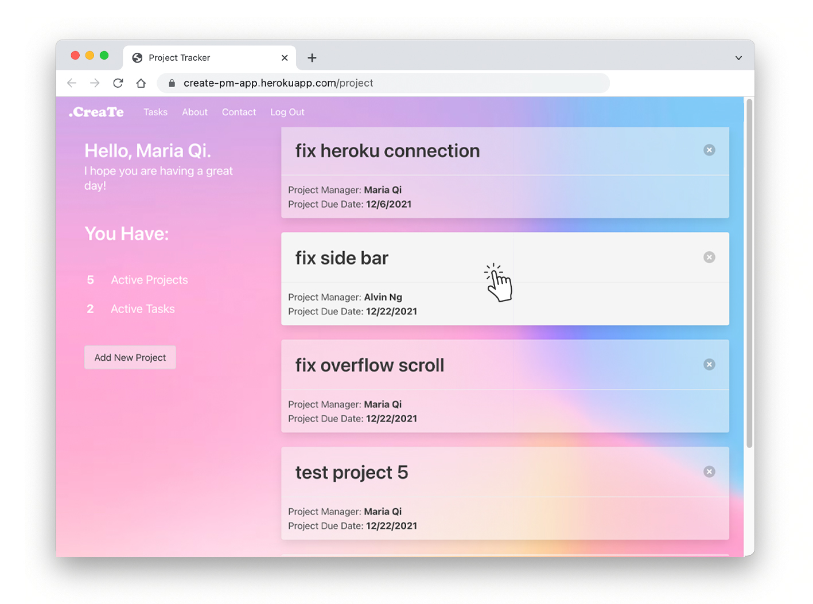

# **Create, project management made easy**

## **[🔗 Demo Here](https://create-pm-app.herokuapp.com/)**

### CreaTe is a visual tool for anyone who wants to plan, organize, and track all their projects and tasks in one place.

## **About The Project**

### CreaTe allows users to add projects and track tasks and manage team's workload from every perspectives.

### User could:

- add project, assign project manager and set milestones
- create project specific tasks and assign to team member
- track project task status and comment on issues
- view and mange all tasks across all projects and manage workload

  

## **Built with**

- Node.js
- Express.js
- MYSQL
- Handlebars.js
- Bulma
- Heroku

## **License**

Distributed under the MIT License.

## **Contact**

Maria Qi
